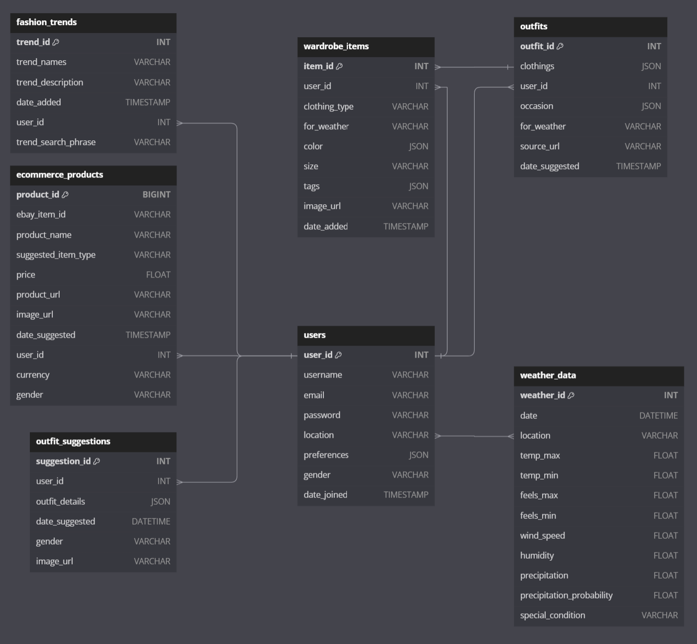

# LazYdrobe

Trouble picking outfits for the upcoming days?  
Too much clothes to keep track of?  
Look no further. Our revolutionary app is here to assist you in keeping up with fashion trends and weather.  
Simply upload items in your wardrobe so that we can suggest future outfits based on the weather conditions and the current fashion trend for you while providing clothing suggestions to fill in the gaps in your wardrobe.

## Features

- **Wardrobe Management**: Users can upload and manage their wardrobe by categorizing items like tops, bottoms, shoes, and accessories.
- **Outfit Suggestions**: Generate personalized outfit recommendations based on the weather, current fashion trends, and user preferences.
- **Weather Integration**: Provides weather-appropriate outfit suggestions based on current and forecasted weather conditions.
- **Fashion Trends**: Keeps users updated with the latest fashion trends ensuring their wardrobe stays trendy.
- **Gap Filling**: Recommends additional clothing items to complete outfits and fill gaps in the user’s wardrobe.
- **E-commerce Integration**: Suggests products from online stores based on wardrobe gaps to help users shop for missing pieces.

## Database Overview

The **LazYdrobe** database is designed to manage user data, wardrobe items, outfit suggestions, weather data, fashion trends, and e-commerce products. The database structure supports efficient retrieval and manipulation of data for various functionalities related to fashion trends and user preferences.

### Database Structure

The database consists of the following tables:

1. **Users**
   - Stores user information such as username, email, hashed password, location, and preferences.
   - **Primary Key:** `user_id`

2. **Wardrobe_Items**
   - Contains information about clothing items owned by users, including type, season, fabric, color, size, tags, and an image URL.
   - **Primary Key:** `item_id`
   - **Foreign Key:** `user_id` references `Users(user_id)`

3. **Outfits**
   - Represents outfit suggestions made to users, including occasion, weather conditions.
   - **Primary Key:** `outfit_id`
   - **Foreign Key:** `user_id` references `Users(user_id)`

4. **Outfit_Wardrobe_Items**
   - A junction table that manages the many-to-many relationship between outfits and wardrobe items.
   - **Primary Key:** Composite of `outfit_id` and `item_id`
   - **Foreign Keys:** 
     - `outfit_id` references `Outfits(outfit_id)`
     - `item_id` references `Wardrobe_Items(item_id)`

5. **Weather_Data**
   - Stores weather information for the users’ locations, including temperature, precipitation, wind speed, and humidity.
   - **Primary Key:** `weather_id`
   - **Foreign Key:** `user_id` references `Users(user_id)`

6. **Fashion_Trends**
   - Contains information about fashion trends, including title, description, categories, image URL, and source URL.
   - **Primary Key:** `trend_id`

7. **E_Commerce_Products**
   - Stores information about e-commerce products recommended to users, including product type, name, price, and image URL.
   - **Primary Key:** `product_id`
   - **Foreign Key:** `user_id` references `Users(user_id)`
  
## Schema Diagram

## Data Model Description

The **LazYdrobe** database is designed using a **SQL relational model**. Below are the key entities and relationships in the system:

### **1. Users**
Stores user information, including preferences and their wardrobe.

- **Attributes**:
  - `user_id` (Primary Key): Unique identifier for each user.
  - `username`: User's display name.
  - `email`: User's email address.
  - `password`: Hashed password for user authentication.
  - `location`: User's location for weather-based outfit suggestions.
  - `preferences`: List of fashion styles preferred by the user.
  - `date_joined`: Date the user registered on the app.

### **2. Clothing**
Represents individual clothing items uploaded by a user which can be connected to an e-commerce product.

- **Attributes**:
  - `item_id` (Primary Key): Unique identifier for each clothing item.
  - `user_id` (Foreign Key): Links to the `Users` table.
  - `product_id` (Foreign Key): Links to the `eCommerceProduct` table if the item corresponds to a purchasable product.
  - `type`: Type of clothing (e.g., jacket, pants).
  - `for_weather`: Suitable weather for the clothing item.
  - `color` (array): List of colors for the item.
  - `size`: Size of the clothing item.
  - `tags` (array): Tags related to the clothing item.
  - `image_url`: URL for the image of the clothing.
  - `date_added`: Date the item was added to the wardrobe.

### **3. eCommerceProduct**
Represents clothing items that can be purchased online, recommended to users based on wardrobe gaps.

- **Attributes**:
  - `product_id` (Primary Key): Unique identifier for the product.
  - `product_name`: Name of the product.
  - `suggested_item_type`: Type of item the product suggests (e.g., outerwear, footwear).
  - `price`: Price of the product.
  - `product_url`: URL to the product page for purchase.
  - `image_url`: URL for the product's image.
  - `date_suggested`: Date when the product was suggested to a user.

### **4. WeatherData**
Stores weather data relevant to a user's location for making weather-appropriate outfit suggestions.

- **Attributes**:
  - `date` (Primary Key): Date when the weather data was recorded.
  - `location`: The location for which the weather data applies.
  - `temp_max`: Maximum temperature.
  - `temp_min`: Minimum temperature.
  - `feels_max`: Feels-like maximum temperature.
  - `feels_min`: Feels-like minimum temperature.
  - `wind_speed`: Wind speed.
  - `humidity`: Humidity percentage.
  - `precipitation`: Amount of precipitation.
  - `precipitation_probability`: Probability of precipitation.
  - `special_condition`: Description of any special weather conditions (e.g., snow, thunderstorms).

### **5. Outfit**
Stores information about generated outfit suggestions based on user wardrobe, weather, and trends.

- **Attributes**:
  - `outfit_id` (Primary Key): Unique identifier for the outfit.
  - `clothings` (array): Array of clothing item IDs that make up the outfit.
  - `occasion` (array): Occasions the outfit is suitable for.
  - `for_weather`: Weather conditions the outfit is appropriate for.
  - `date_suggested`: Date when the outfit was suggested to the user.
  - `source_url`: URL where the outfit inspiration came from.

### **6. Fashion**
Stores fashion trend data that helps inform outfit recommendations.

- **Attributes**:
  - `trend_id` (Primary Key): Unique identifier for each trend.
  - `trend_names`: Name of the fashion trend.
  - `description`: Description of the trend.
  - `temperature`: Weather conditions that fit the trend.
  - `occasion`: Occasions or events where the trend is suitable.
  - `image_url`: URL to an image showcasing the trend.
  - `example_fits` (array): Example outfits that fit the trend.

### **Relationships**
- **User** to **Clothing**: One-to-Many (a user can have multiple clothing items in their wardrobe).
- **Clothing** to **eCommerceProduct**: One-to-One (a clothing item may have a related e-commerce product).
- **Outfit** to **Clothing**: One-to-Many (an outfit consists of multiple wardrobe items).
- **Outfit** to **WeatherData**: One-to-One (outfits are suggested based on specific weather conditions).
- **Outfit** to **Fashion**: Many-to-One (outfits may follow a specific fashion trend).
- **WeatherData** to **Outfit**: Many-to-One (outfit suggestions are influenced by weather data).

### Why We Chose SQL for LazYdrobe

1. **Structured Data and Relationships**  
   LazYdrobe handles well-defined entities like Users, Wardrobe Items, Outfits, and Weather Data, all with clear relationships. SQL's use of primary and foreign keys helps enforce these connections efficiently ensuring data integrity.

2. **Data Integrity and Consistency**  
   SQL provides ACID properties (Atomicity, Consistency, Isolation, Durability) to maintain strong data integrity. This ensures that operations like adding wardrobe items or generating outfit suggestions are reliable and consistent.

3. **Complex Queries**  
   Generating outfit suggestions requires complex joins between multiple tables (e.g., Users, WardrobeItems, WeatherData). SQL excels at handling such joins and aggregations making it ideal for our application's data retrieval needs.

4. **Scalability**  
   Modern SQL databases support scalability through partitioning and indexing making them capable of handling larger datasets as the app grows.

5. **Data Consistency Over Flexibility**  
   LazYdrobe benefits from the structured schema enforcement SQL provides. While NoSQL offers flexibility, SQL's consistency ensures that wardrobe items, trends, and weather data are always valid and related correctly.

## Database Setup and Usage Instructions

The provided SQL script facilitates the creation and setup of a fashion trend e-commerce database. It includes the following sections:

Database Creation: Creates the database if it does not already exist.
Table Definitions: Defines tables with appropriate fields, data types, and relationships.
Sample Data Insertion: Inserts sample data into each table to facilitate testing and development.

### Step 1: Clone the Repository
Clone this repository or download the source code using the following command:
git clone https://github.com/abd-abdur/LazYdrobe.git

### Step 2: Navigate to the Project Directory
Change your current directory to the project directory:
cd path/to/LazYdrobe

### Step 3: (Optional) Create a Virtual Environment
It's recommended to create a virtual environment for this project. 
You can do this by running: 
python -m venv .venv

### Step 4: Install Required Packages
Install the required packages by running:
pip install -r requirements.txt

### Step 5: Access the Query Editor
Launch a MySQL-compatible database management system (e.g., MySQL Workbench, phpMyAdmin, etc.).
Navigate to the query editor section of your DBMS.

### Step 6: Copy the entire SQL script provided in this repository
Paste the copied script into the query editor.
Run the script by clicking the 'Execute' button or using the appropriate command (usually F5 or Ctrl + Enter).
This will create the database, define tables, and insert sample data.

### Sample SQL Script Overview
The SQL script contains the following components:

Database and Table Creation: Creates fashion_trend_ecommerce_db and relevant tables such as Users, Wardrobe_Items, Outfits, etc.
Data Insertion: Inserts sample users, wardrobe items, outfits, weather data, fashion trends, and e-commerce products.

## Testing the Database

After the database and tables are set up:

- You can run SQL queries to test and retrieve data.
- Feel free to modify the sample data as needed for further testing.

## Requirements
- MySQL or any compatible relational database management system.
- Basic knowledge of SQL to interact with the database.
